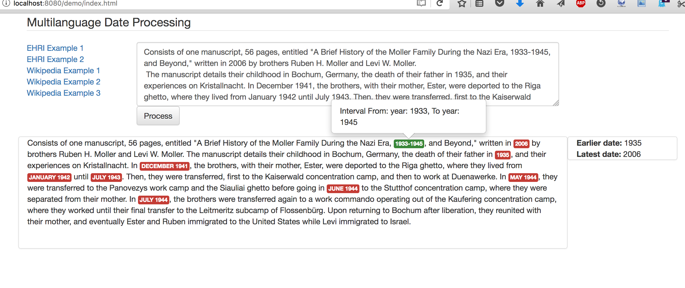

# Snake-PALM #

[](https://travis-ci.org/lfoppiano/snake-palm)
[](https://coveralls.io/r/lfoppiano/snake-palm)

Extraction and processing of temporal expressions, as dates, periods (intervals) or lists. Based on GROBID (http://github.com/kermitt2/grobid) and GROBID-NER (http://github.com/kermitt2/grobid-ner) CRF models. 



### Dependencies ###

 - GROBID, branch [dropwizard-service](https://github.com/kermitt2/grobid/tree/dropwizard-service)
 - GROBID-NER, branch [newModelUsingXml](https://github.com/kermitt2/grobid-ner/tree/newModelUsingXml)
 
### Getting started ###

1. Install GROBID (branch dropwizard-service)
```bash
> git clone https://github.com/kermitt2/grobid.git
> git checkout dropwizard-service
> cd grobid
> ./gradlew clean install
``` 

2. Install GROBID-NER (branch newModelUsingXML)
```bash
> git clone https://github.com/kermitt2/grobid-ner.git # Check it out inside the grobid directory
> git checkout newModelUsingXML
> mvn clean install 
``` 

3. Set up GROBID-NER (assuming you are still in the grobid directory) 
```bash
> cp -r grobid-ner/grobid-home grobid-home  
``` 

4. Train the Temporal Expression model
```bash
cd grobid-ner/grobid-ner 
> mvn generate-resources -Ptrain_temporalExpression
```

5. Run the service 
```bash
> cd snake-palm 
> sbt compile
> sbt run
```

6. Connect with the browser to http://localhost:8080/demo/index.html

